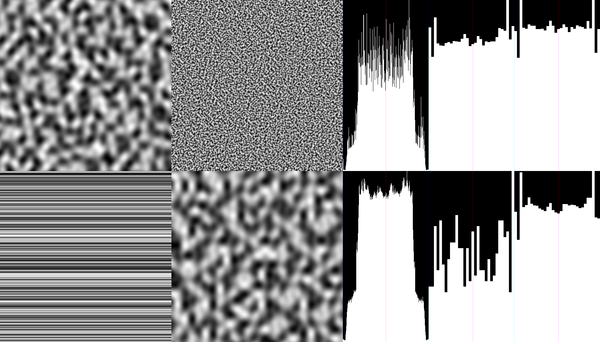
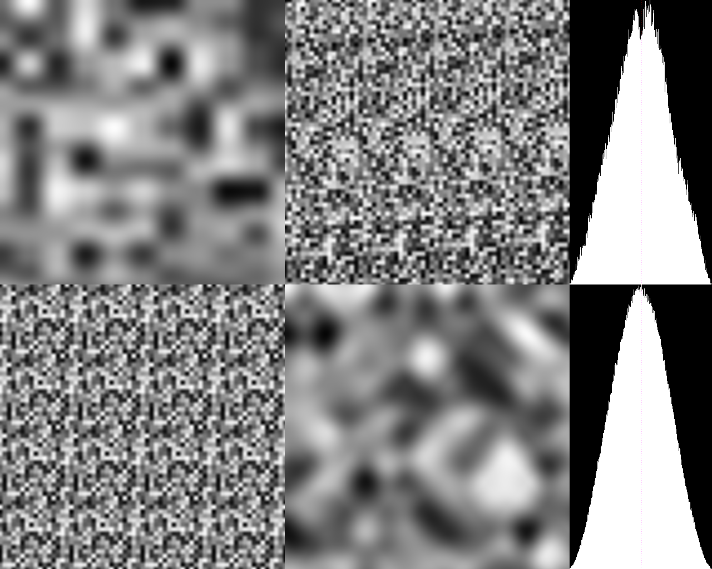
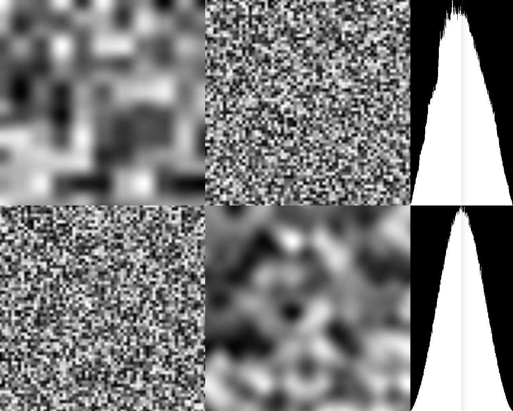
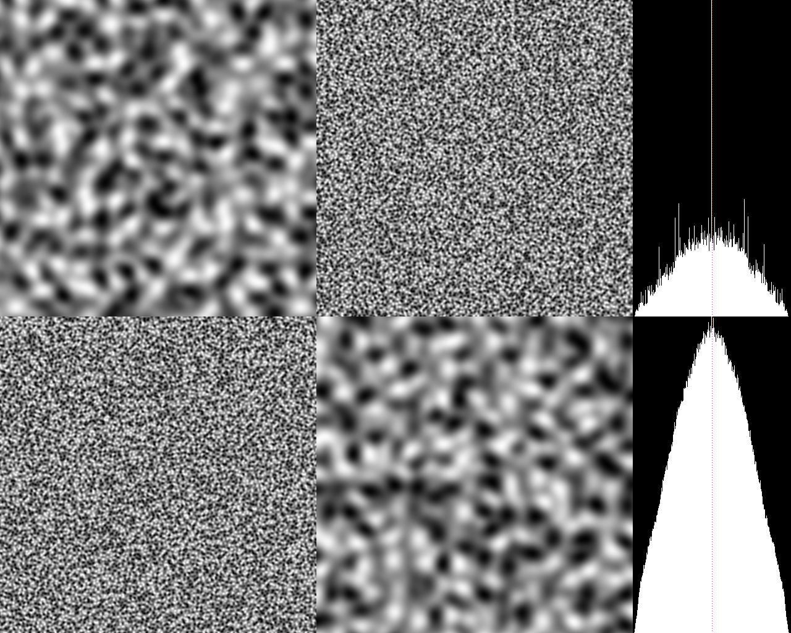
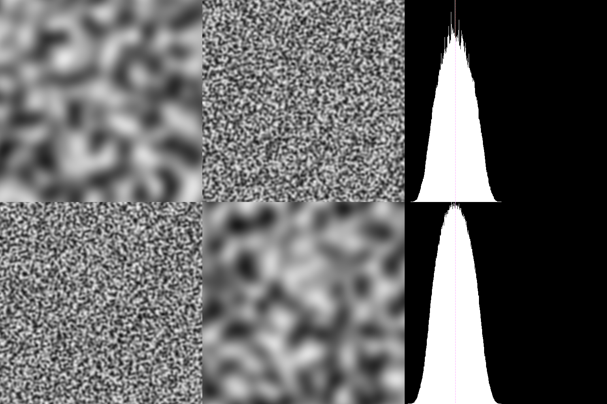
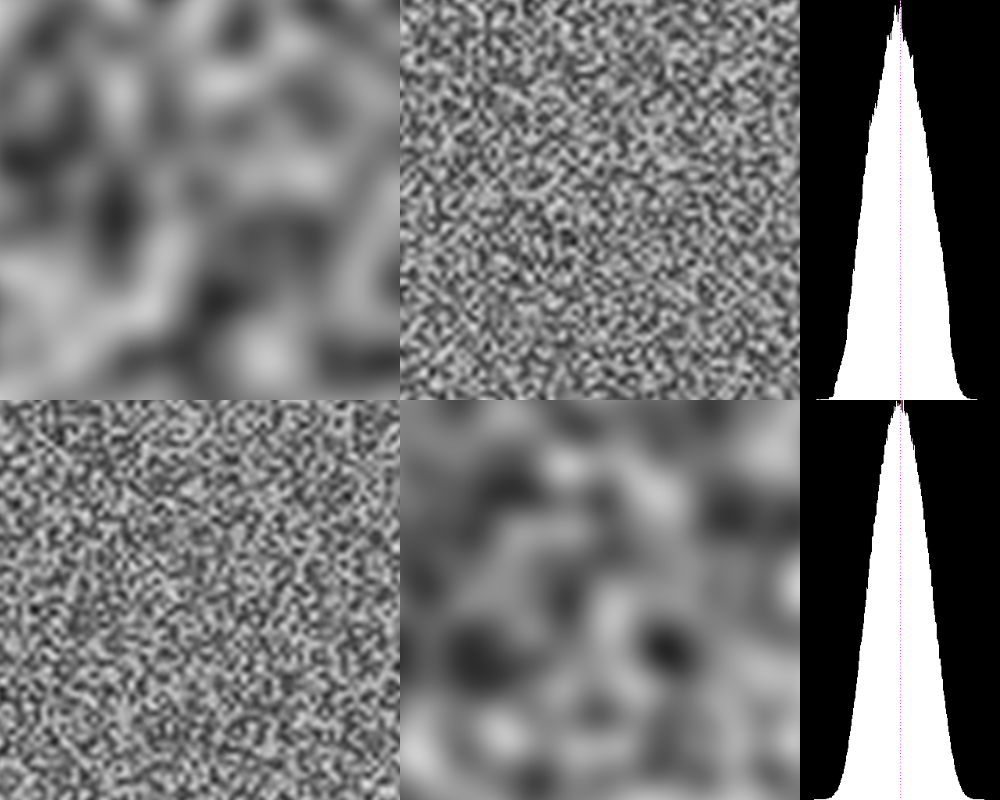

3D Noise Tests
==============

Results (sampling 1 million points, looking at planar slices):
* simplex-noise-2d: 99.4ms
  * output: not valid, just for comparison

* perlin-noise-3d: 105.1ms
  * 4096 noise values, repeats at 16x16x16?
  * output: strong artifacts

* perlin3d-no-lookup: 139.3ms
  * no tiling or precalculation
  * output: strong artifacts

* simplex-noise-3d: 125.2ms
  * patented
  * 512 noise values, repeats?
  * output: good

* open-simplex-noise-3d: 148.4ms
  * 256 noise values, repeats?
  * output: good

* cubic-3d: 676.7ms
  * super slow
  * no tiling
  * output: good

