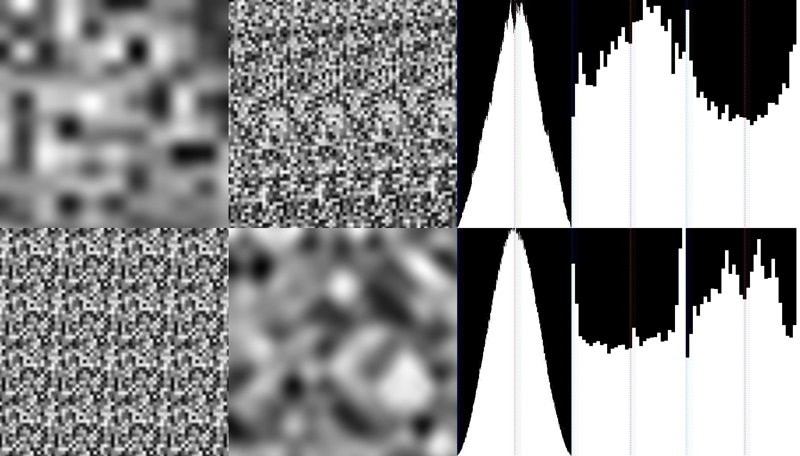
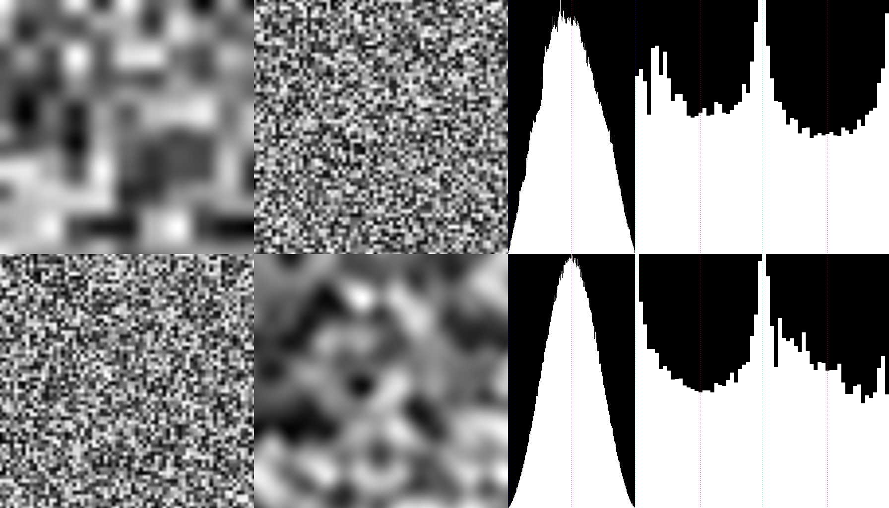
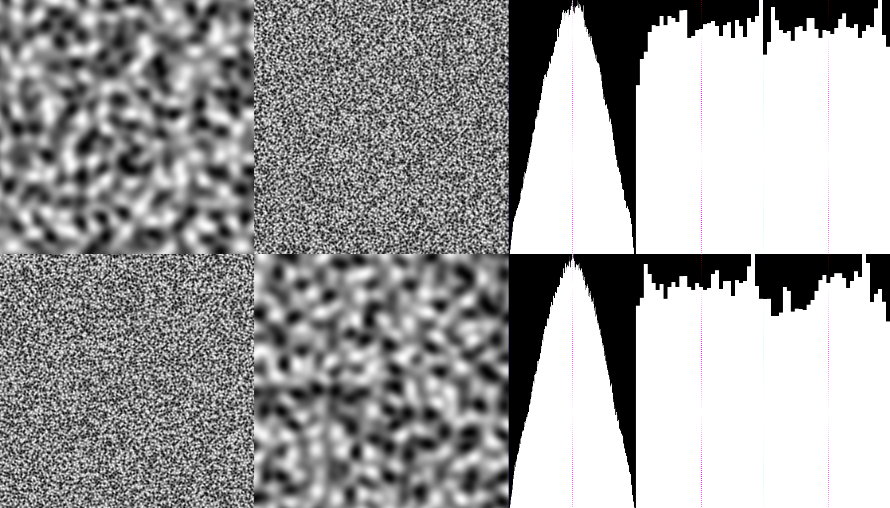
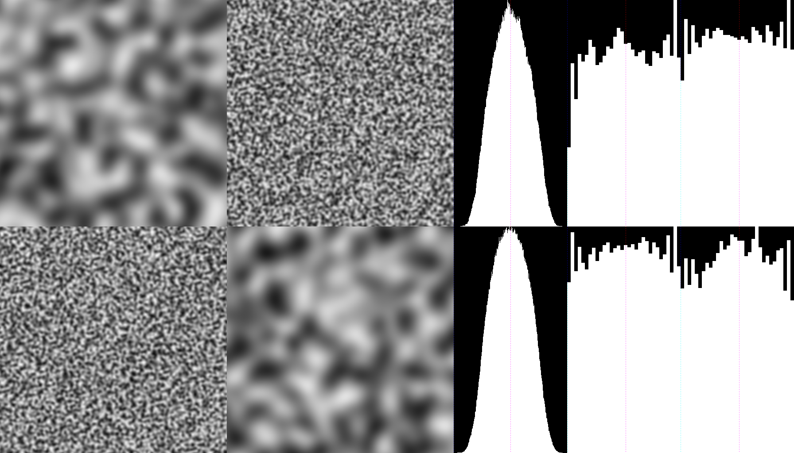
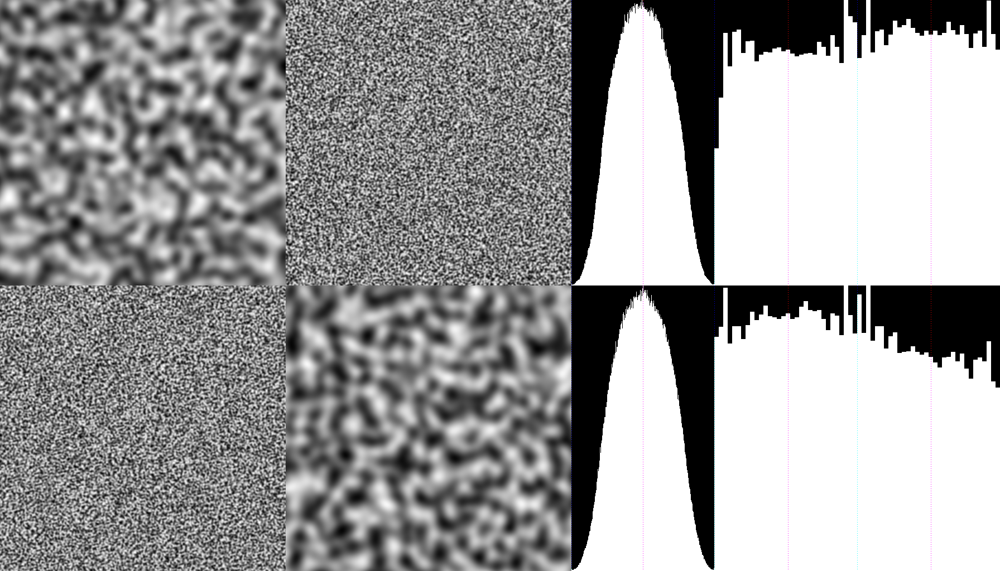
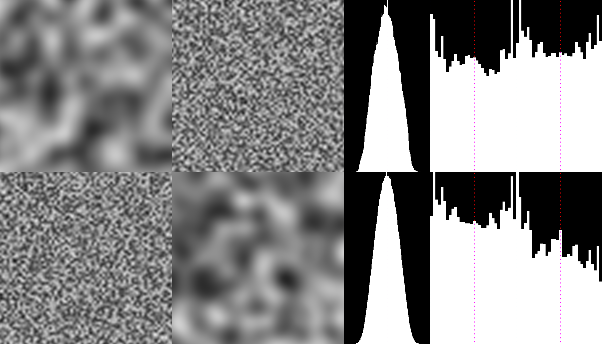

3D Noise Tests
==============

Results
* Timing and bottom histogram is for sampling 1 million completely random points
* 4 images and top histogram are looking at 4 fixed planar slices (2 axis-aligned, 2 not)

* simplex-noise-2d: 99.4ms
  * output: not valid, just for comparison

* perlin-noise-3d: 105.1ms
  * 4096 noise values, repeats at 16x16x16
  * output: strong artifacts

* perlin3d-no-lookup: 139.3ms
  * no repetition or precalculation
  * output: strong artifacts

* simplex-noise-3d: 125.2ms
  * patented
  * 512 noise values, repeats at 256x256x256
  * output: good

* open-simplex-noise-3d: 148.4ms
  * 256 noise values, repeats at 256x256x256
  * output: pretty good, slightly weird distirubtion

* open-simplex-noise-3d scaled by 16%, zoomed by 2x
  * similar distribution and contour rate as `simplex-noise-3d`

* cubic-3d: 676.7ms
  * super slow
  * no repetition
  * output: good

